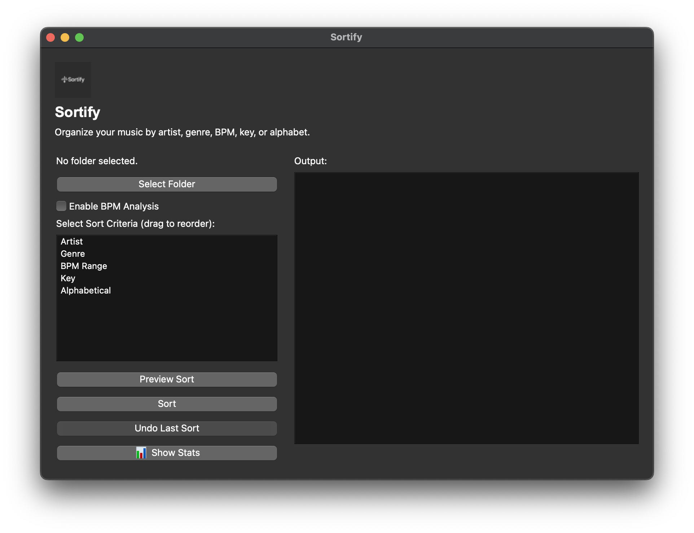

# 🎵 Sortify

Sortify is a desktop music sorter app built with Python and PyQt6. It organizes your audio library into folders and subfolders based on metadata like **Artist**, **Genre**, **BPM**, **Key**, and **Alphabetical order**. It supports drag-and-drop folders, undo sorting, and even statistical insights about your library.

---

## ✨ Features

- 🎧 **Sort by**: Artist, Genre, BPM Range, Musical Key, Alphabetical
- 💡 **Genre normalization** (e.g. DnB, Drum & Bass → Drum & Bass)
- 🧠 **Key & BPM detection** using `librosa`
- 📂 **Drag and drop folder** support
- 🔄 **Undo sorting** with one click
- 📊 **Statistics panel**: genre, artist, BPM range, total storage
- 🌗 **Light/Dark theme detection**
- 🎛️ Smooth animations and responsive UI (multithreaded)
- 🍏 **Mac Dock integration**: custom name & icon in Dock

---

## 🖼️ Screenshots

## 🛠 Requirements

- Python 3.9+
- `PyQt6`
- `mutagen`
- `librosa`
- `numpy`, `soundfile` (for `librosa` backend)

## Install dependencies:
`pip install -r requirements.txt`

## 🚀 Usage
`python main.py`

- Click “Select Folder” or drop a folder onto the app window.
- Choose sort criteria from the list (drag to reorder).
- Click Preview or Sort.
- Use Undo to return files to the root.
- Use Stats Panel to explore your library.

## 📝 License
MIT License © 2025 [Nicholas Arruzza]
